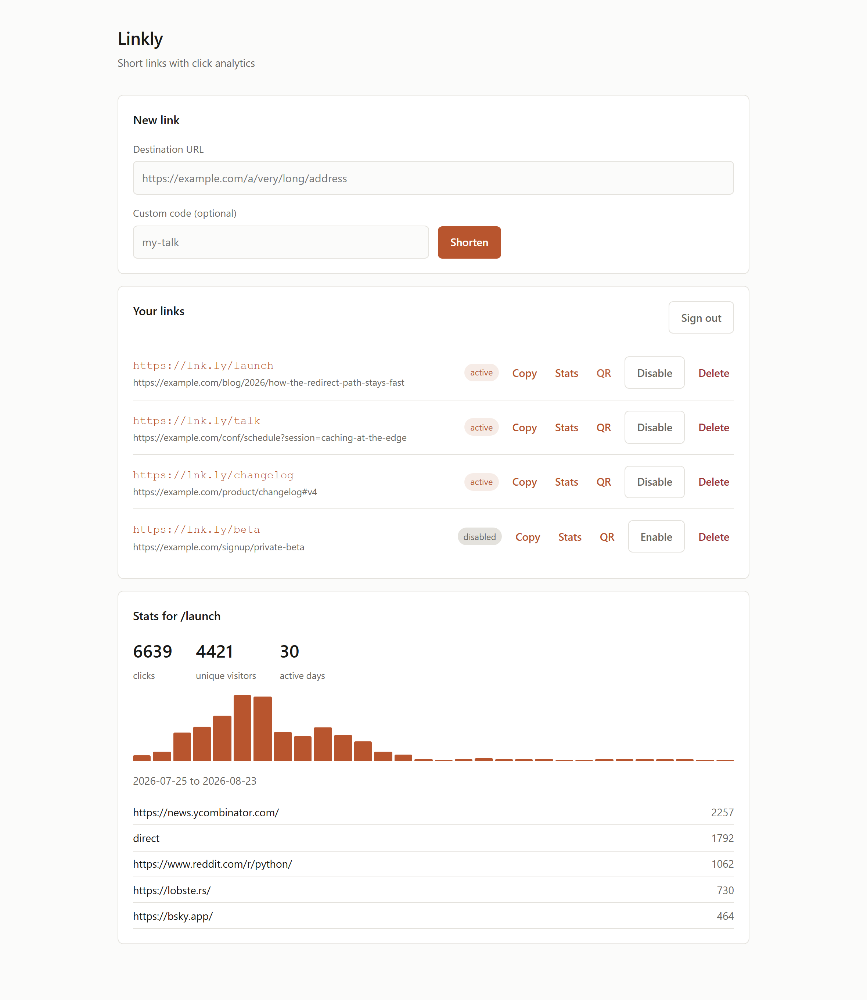
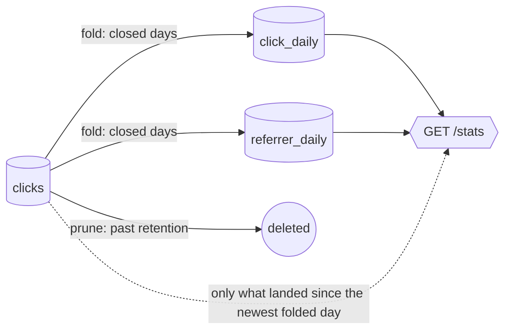

# Linkly

A URL shortener API where the interesting part is not the shortening — it is everything
around it: cache-first redirects, per-user rate limiting, and click analytics that never
sit in the request path.

Built with FastAPI, PostgreSQL and Redis, with a dashboard on top of the public API.

[](https://github.com/Nappuccino-tlg/linkly/actions/workflows/ci.yml)




<sub>The dashboard at `/app/`, running against sample data.</sub>

---

## How it works


The redirect path is the hot path, so it is the one that got the attention:

1. **Redis first.** A cache hit resolves the link without touching Postgres at all — the
   cached record carries the link id too, which is what makes that possible.
2. **307, not 301.** A permanent redirect gets cached by the browser, and then the second
   click never reaches the server. Analytics would count one click and stop.
3. **Clicks are written after the response is sent**, in a background task with its own
   database session. A slow analytics insert can never slow down a redirect.

## API

| Method | Path | Description |
|---|---|---|
| `POST` | `/auth/register` | Create an account |
| `POST` | `/auth/token` | Exchange email + password for a JWT |
| `GET` | `/auth/me` | Current user |
| `POST` | `/api/links` | Create a short link (optional vanity code and expiry) |
| `GET` | `/api/links` | List your links, newest first |
| `GET` | `/api/links/{code}` | Link detail |
| `PATCH` | `/api/links/{code}` | Repoint, expire or disable a link |
| `DELETE` | `/api/links/{code}` | Delete a link and invalidate its cache entry |
| `GET` | `/api/links/{code}/stats` | Clicks, visitors, daily buckets, top referrers |
| `GET` | `/api/links/{code}/qr` | QR code for the short link, as PNG or SVG |
| `GET` | `/{code}` | The redirect itself |
| `GET` | `/healthz` · `/readyz` | Liveness, and readiness that checks Postgres and Redis |
| `GET` | `/app/` | The dashboard |

Interactive docs at `/docs` once running, and the dashboard at `/app/`.

## The dashboard

`/app/` is three files — one HTML page, one stylesheet, one script — served straight
from the API container. No bundler, no `node_modules`, no build step in CI, and nothing
to keep in sync at deploy time.

It is deliberately just another API client: it signs in for a token and then calls the
same public endpoints anyone else would. Nothing is exposed to it that is not already
documented at `/docs`. The one place that shape shows through is the QR code — the
endpoint is owner-only, so an `` cannot fetch it (there is no way to attach a
bearer token to an image request) and the page fetches it as a blob instead.

## Keeping stats fast

`/stats` used to aggregate the `clicks` table on every call. That is exact, and it is fine
right up until it is not: the work grows with the traffic being reported on, so a link
with three million clicks pays for three million rows to answer "how did last week go".

Closed days are folded into one row per link per day, and `/stats` reads those. What is
left to scan live is whatever has arrived since the newest folded day — usually a few
hours of one link's traffic. The cost of a stats call stops tracking the link's success.



Two commands, and neither has to run for `/stats` to be correct:

```bash
python -m app.rollup fold             # recompute recent closed days
python -m app.rollup prune            # delete raw rows past CLICK_RETENTION_DAYS
```

`fold` hourly and `prune` daily is plenty. The details worth knowing:

**The boundary comes from the data, not the clock.** `/stats` asks which day this link was
last folded up to and reads live rows from there on. A fold that has not run yet costs
accuracy nothing — the day is simply still counted from the raw table. That is what makes
the schedule an optimisation rather than a dependency.

**`fold` replaces a day rather than adding to it,** which is what makes running it twice a
no-op instead of a doubling. It also means a click that lands after its own day was folded
— a background task crossing midnight — is picked up by the next run instead of being lost.

**`prune` folds the rows it is about to delete, in the same transaction.** There is no
window in which a day has been deleted but not summarised, so the two commands cannot be
scheduled into a state that loses data.

**Nothing in it changes an answer.** [`tests/api/test_rollup.py`](tests/api/test_rollup.py)
mostly runs the same query twice — once against raw clicks, once after those rows have
been folded and in some cases deleted — and asserts the two agree. To measure the payoff
on your own hardware:

```bash
python scripts/benchmark_stats.py --clicks 2000000 --days 365
```

That seeds a link, times `/stats`, folds, times it again, and checks the two responses are
identical — because a speedup that changed the numbers would not be a speedup.

## Running it

```bash
cp .env.example .env
docker compose up --build
```

That brings up Postgres, Redis and the API on <http://localhost:8000>, running migrations
on the way up. Open <http://localhost:8000/app/>, create an account, and shorten
something — the redirect, the click counter and the QR code all work locally.

Without Docker:

```bash
python -m venv .venv && source .venv/bin/activate   # Windows: .venv\Scripts\activate
pip install -e ".[dev]"
alembic upgrade head
uvicorn app.main:app --reload
```

Nothing schedules the rollups locally; run them by hand when you want to see them work.

## Tests

`tests/unit` is pure logic — hashing, tokens, code generation, config guards, which
client address to believe, what an expiry may say — and runs anywhere with nothing but
Python:

```bash
pytest tests/unit
```

`tests/api` drives the real app against a real Postgres and a real Redis. Unique indexes,
SQL aggregation and TTL behaviour are most of what those tests check, and none of it
survives a mock:

```bash
createdb linkly_test
pytest
```

Redis database 15 is used for tests and is flushed between them — do not point
`REDIS_URL` at anything you care about.

## Deploying

[fly.toml](fly.toml) is set up for Fly.io, including a release command that runs migrations
before new machines take traffic. It needs a database, a Redis, and a real secret —
roughly the following, though check [Fly's own docs](https://fly.io/docs/) for the
current command names:

```bash
fly launch --no-deploy
fly postgres create --name linkly-db && fly postgres attach linkly-db
fly redis create
fly secrets set JWT_SECRET="$(python -c 'import secrets; print(secrets.token_urlsafe(48))')" REDIS_URL="<from fly redis create>"
fly deploy
```

`ENVIRONMENT=production` makes the app refuse to start on a default or short `JWT_SECRET`,
so a forgotten secret fails the deploy instead of shipping forgeable tokens. Set
`TRUSTED_PROXY_HOPS=1` behind Fly, or behind any single reverse proxy — see the design
note below for what goes wrong if you do not.

The rollups are not part of the app process. They are two scheduled commands:

```bash
fly machine run . --schedule hourly --command "python -m app.rollup fold"
fly machine run . --schedule daily  --command "python -m app.rollup prune"
```

Neither is on the critical path, so a machine that fails to start costs latency on
`/stats` and nothing else.

## Design notes

**Code collisions are handled by the database, not by a check.** `generate_code()` produces
a random base62 string, and a check-then-insert would still let two concurrent requests
pick the same code. The unique index on `links.code` is the actual guarantee; the handler
catches the integrity error and retries with a fresh code.

**A shortener is an open redirector, so the target is checked.** `app/urlguard.py`
refuses loopback, private, link-local and reserved addresses — including the cloud
metadata endpoint at `169.254.169.254` — and refuses URLs carrying credentials, because
`http://apple.com@evil.example` reads as Apple to everyone except the browser. It does
this without resolving hostnames, so the guard cannot itself be used to make the server
issue outbound requests. Catching a domain that *resolves* somewhere private needs
resolve-then-pin at redirect time; this is the floor, not the ceiling.

**Every response carries an `X-Request-ID`,** and every JSON log line for that request
carries the same value. A report of "it broke around 14:02" becomes one grep. Ids
supplied by the client are constrained before being echoed, since they land in logs.

**`/healthz` and `/readyz` are different questions.** Liveness asks whether the process
is up and must never depend on Postgres, or a database blip restarts healthy containers.
Readiness asks whether this instance can serve traffic right now, and does check both
dependencies, so a rolling deploy waits for an instance that actually works.

**Unhandled failures still hand back a request id.** Without a catch-all handler, an
unreachable database returns a bare plain-text 500 — no id, nothing for a user to
quote. The traceback goes to the log, correlated by id; the reply carries the id and
nothing else about what went wrong.

**`/favicon.ico` has its own route.** Browsers request it unprompted, and without one it
falls through to `/{code}` and costs a database lookup on every page view.

**Raw IP addresses are never stored.** Unique-visitor counts come from a salted SHA-256 of
the address, which is enough to count distinct people and not enough to identify them.

**Only failed sign-ins cost anything.** The limiter checks the budget before an attempt
and spends from it only when the password was wrong, so someone signing in correctly forty
times is never locked out while someone guessing gets ten tries. It is keyed on the IP and
on the email at once: per-IP alone lets one attacker spread guesses for a single account
across a botnet, and per-email alone lets one host walk a password list through a set of
accounts. Neither is much use without the other.

**`X-Forwarded-For` is a request header like any other.** Anyone talking to the app
directly can put whatever they like in it, and this value keys the per-IP rate limit and
seeds the unique-visitor hash — so trusting it unconditionally hands both away, since a
fresh value per request is an unlimited quota and an unlimited visitor count. It is read
only when `TRUSTED_PROXY_HOPS` says a proxy is really in front, and then only the entry
that proxy appended. The default is 0: believe the socket.

**A unique visitor is counted per day.** Someone who comes back tomorrow counts twice, and
that is a choice rather than a rounding error. An exact all-time distinct would mean either
keeping every raw click row forever or carrying a sketch per link, and the number it
produces answers a question nobody asks of a short link. The per-day figure is the one that
makes a chart, and it is exact.

**Rate limiting is a fixed window,** keyed per user and per IP. A burst straddling a window
boundary can pass up to twice the limit; a sliding window would fix that at the cost of a
sorted set per client, which is not worth it at this size. The tradeoff is deliberate,
not an oversight.

**QR codes are generated on demand, not stored.** Rendering one takes about a millisecond,
so caching them would trade real storage for imaginary savings. The response carries a
one-day `immutable` cache header instead and lets the client keep it.

**Vanity codes cannot shadow real routes.** `docs`, `api`, `auth` and friends are reserved,
otherwise someone could claim `/docs` and take out the API documentation.

## Roadmap

- [x] QR code generation per link (PNG and SVG)
- [x] Repoint or disable a link without changing its code
- [x] Dashboard at `/app/`, no build step
- [x] Aggregate click rollups so stats stay fast past a few million rows
- [ ] Resolve-then-pin at redirect time, so a hostname cannot resolve somewhere private

## Contributing

Issues and pull requests are welcome — see [CONTRIBUTING.md](CONTRIBUTING.md) for what CI
expects and what the code is trying to be. Security issues go through
[private reporting](SECURITY.md) rather than the issue tracker.

## License

MIT
