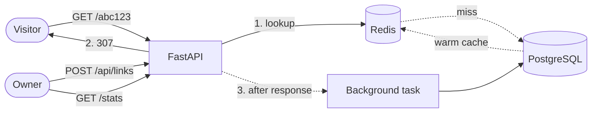

# Linkly

A URL shortener API where the interesting part is not the shortening — it is everything
around it: cache-first redirects, per-user rate limiting, and click analytics that never
sit in the request path.

Built with FastAPI, PostgreSQL and Redis.

<!-- Replace OWNER with your GitHub username once the repo is pushed. -->
[](https://github.com/OWNER/linkly/actions/workflows/ci.yml)


---

## How it works



The redirect path is the hot path, so it is the one that got the attention:

1. **Redis first.** A cache hit resolves the link without touching Postgres at all — the
   cached record carries the link id too, which is what makes that possible.
2. **307, not 301.** A permanent redirect gets cached by the browser, and then the second
   click never reaches the server. Analytics would count one click and stop.
3. **Clicks are written after the response is sent**, in a background task with its own
   database session. A slow analytics insert can never slow down a redirect.

## API

| Method | Path | Description |
|---|---|---|
| `POST` | `/auth/register` | Create an account |
| `POST` | `/auth/token` | Exchange email + password for a JWT |
| `GET` | `/auth/me` | Current user |
| `POST` | `/api/links` | Create a short link (optional vanity code and expiry) |
| `GET` | `/api/links` | List your links, newest first |
| `GET` | `/api/links/{code}` | Link detail |
| `DELETE` | `/api/links/{code}` | Delete a link and invalidate its cache entry |
| `GET` | `/api/links/{code}/stats` | Clicks, unique visitors, daily buckets, top referrers |
| `GET` | `/api/links/{code}/qr` | QR code for the short link, as PNG or SVG |
| `GET` | `/{code}` | The redirect itself |

Interactive docs at `/docs` once running.

## Running it

```bash
cp .env.example .env
docker compose up --build
```

That brings up Postgres, Redis and the API on <http://localhost:8000>, running migrations
on the way up.

Without Docker:

```bash
python -m venv .venv && source .venv/bin/activate   # Windows: .venv\Scripts\activate
pip install -e ".[dev]"
alembic upgrade head
uvicorn app.main:app --reload
```

## Tests

`tests/unit` is pure logic — hashing, tokens, code generation, config guards — and runs
anywhere with nothing but Python:

```bash
pytest tests/unit
```

`tests/api` drives the real app against a real Postgres and a real Redis. Unique indexes,
SQL aggregation and TTL behaviour are most of what those tests check, and none of it
survives a mock:

```bash
createdb linkly_test
pytest
```

Redis database 15 is used for tests and is flushed between them — do not point
`REDIS_URL` at anything you care about.

## Deploying

[fly.toml](fly.toml) is set up for Fly.io, including a release command that runs migrations
before new machines take traffic. It needs a database, a Redis, and a real secret:

```bash
fly launch --no-deploy
fly postgres create --name linkly-db && fly postgres attach linkly-db
fly redis create
fly secrets set JWT_SECRET="$(python -c 'import secrets; print(secrets.token_urlsafe(48))')" REDIS_URL="<from fly redis create>"
fly deploy
```

`ENVIRONMENT=production` makes the app refuse to start on a default or short `JWT_SECRET`,
so a forgotten secret fails the deploy instead of shipping forgeable tokens.

## Design notes

**Code collisions are handled by the database, not by a check.** `generate_code()` produces
a random base62 string, and a check-then-insert would still let two concurrent requests
pick the same code. The unique index on `links.code` is the actual guarantee; the handler
catches the integrity error and retries with a fresh code.

**Raw IP addresses are never stored.** Unique-visitor counts come from a salted SHA-256 of
the address, which is enough to count distinct people and not enough to identify them.

**Rate limiting is a fixed window,** keyed per user and per IP. A burst straddling a window
boundary can pass up to twice the limit; a sliding window would fix that at the cost of a
sorted set per client, which is not worth it at this size. The tradeoff is deliberate,
not an oversight.

**QR codes are generated on demand, not stored.** Rendering one takes about a millisecond,
so caching them would trade real storage for imaginary savings. The response carries a
one-day `immutable` cache header instead and lets the client keep it.

**Vanity codes cannot shadow real routes.** `docs`, `api`, `auth` and friends are reserved,
otherwise someone could claim `/docs` and take out the API documentation.

## Roadmap

- [x] QR code generation per link (PNG and SVG)
- [ ] Bulk import from CSV
- [ ] Aggregate click rollups so stats stay fast past a few million rows
- [ ] A small React dashboard on top of the API

## License

MIT
